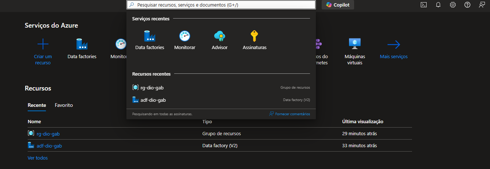
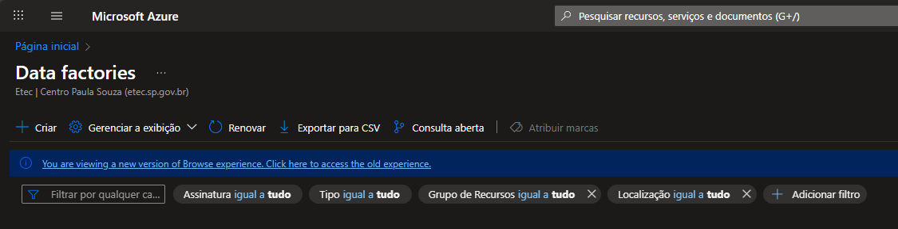
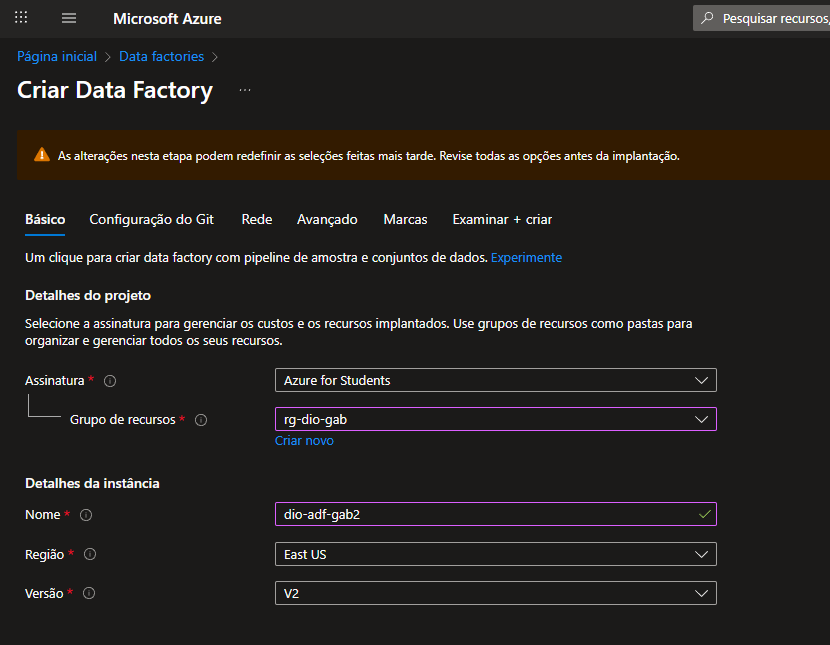
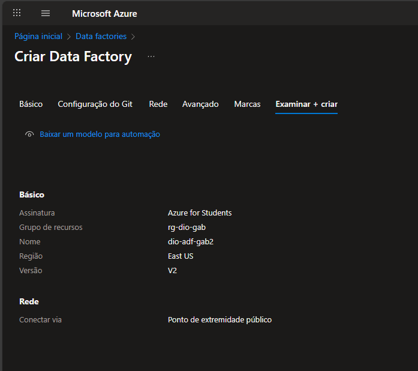
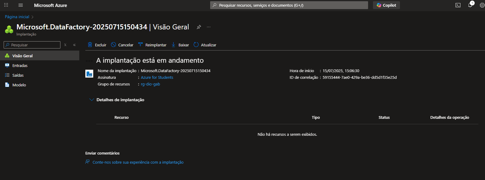
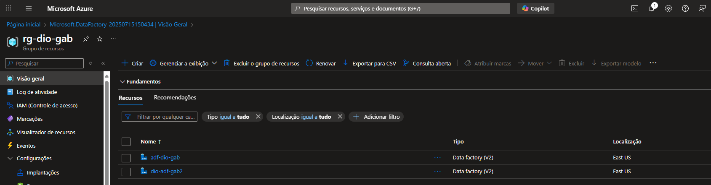
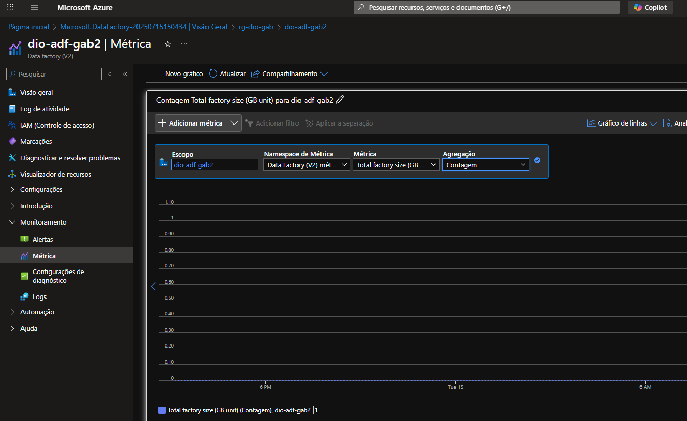
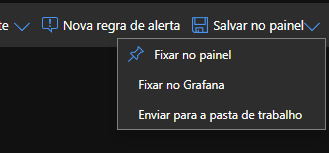
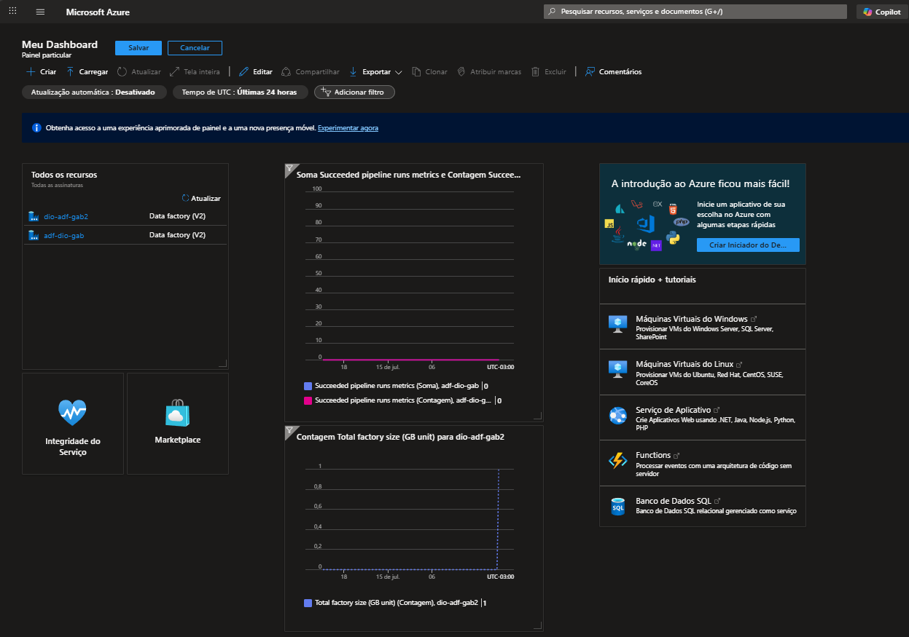

📘 Criando um Azure Data Factory e Fixando Métricas no Dashboard
Este guia passo a passo mostra como criar um recurso de Data Factory no Microsoft Azure e configurar métricas no painel do portal para visualização rápida.
Os prints de tela correspondentes estão numerados e disponíveis na pasta img/.

🔹 Etapa 1: Acesse o portal do Azure e pesquise por "Data Factory"
No menu inicial do portal, utilize a barra de pesquisa para encontrar o serviço Data Factory.

🔹 Etapa 2: Criar um novo Data Factory
Clique sobre Data Factory nos resultados da busca.
Em seguida, clique no botão Criar para iniciar o processo de criação do recurso.

🔹 Etapa 3: Preencha os dados do novo recurso
No formulário de criação, insira as informações obrigatórias:

Assinatura

Grupo de recursos

Nome do Data Factory (utilize a tag recomendada adf-<nome> conforme as boas práticas da Microsoft)

Região

Outras configurações conforme necessidade

🔹 Etapa 4: Validar e criar
Revise todas as informações preenchidas na aba "Examinar e criar".
Se estiver tudo correto, clique em Criar.

🔹 Etapa 5: Confirmação de criação
Após alguns segundos, o recurso será provisionado. Você verá a mensagem de confirmação de criação bem-sucedida.

🔹 Etapa 6: Acesse seu Data Factory
Com o recurso criado, você será redirecionado para a lista de Data Factories.
Clique sobre o Data Factory recém-criado para acessar suas configurações.

🔹 Etapa 7: Inserir métricas para o dashboard
Dentro do painel do recurso, localize a seção de métricas ou monitoramento.
Adicione os gráficos desejados para acompanhar o desempenho do recurso.

🔹 Etapa 8: Fixar no painel do Azure
Após selecionar as métricas desejadas, clique na opção "Fixar no painel" para adicioná-las ao seu painel principal do portal Azure.

🔹 Etapa 9: Visualize no dashboard
Volte ao Painel inicial do Azure para verificar a métrica fixada.
Agora, sempre que acessar o portal, você terá uma visão rápida do desempenho do seu Data Factory.

